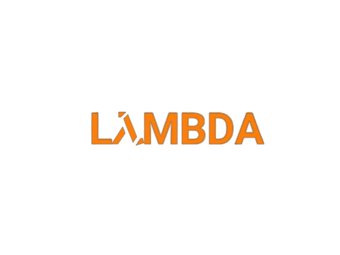

# 

***LambdaOS***

LambdaOS is an open source operating system based on Linux Mint.
- See our [website](https://lambdadevelopment.github.io/lambdaos) to see our latest release.
---

LambdaOS, Copyright (c) 2023 by SDCast.

This operating system is released under the GPL v3 with the additional exemption
that compiling, linking, and/or using OpenSSL is allowed. You may
provide binary packages linked to the OpenSSL libraries, provided that
all other requirements of the GPL are met.
See file LICENSE for details.

